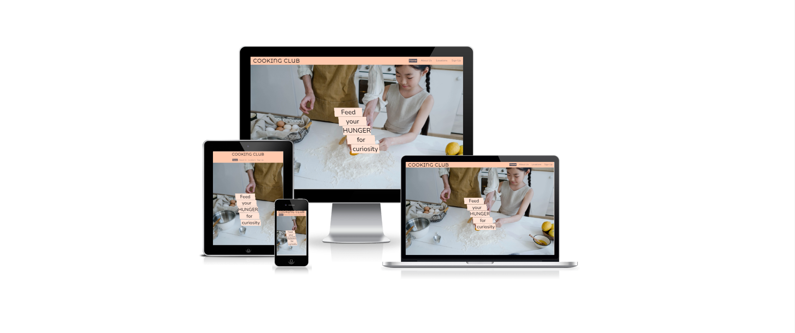
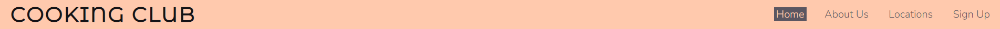
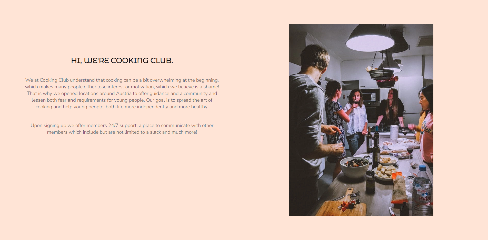
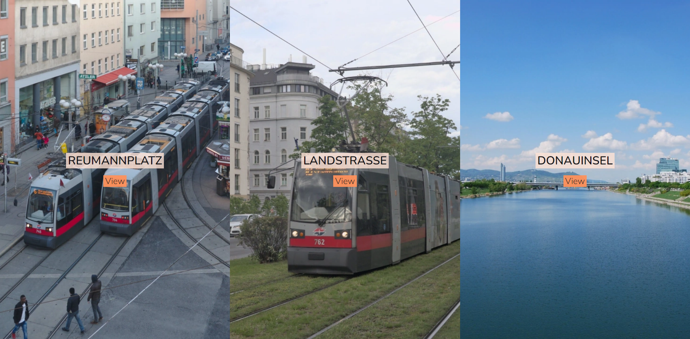
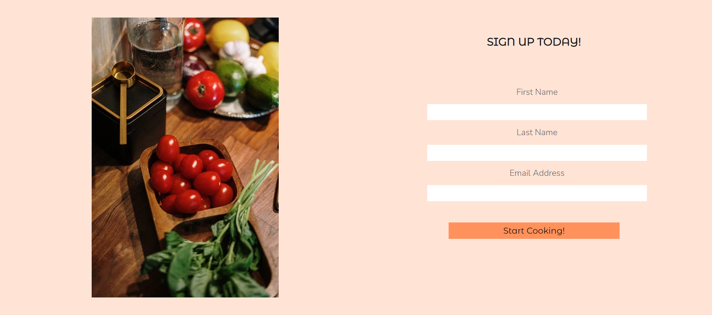
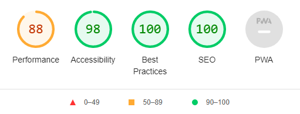

# Cooking Club

Cooking Club is a website that tries to remove the fear out of cooking that many young people share and to motivate them. It targets mostly younger people that have thought about getting started with cooking, but got overwhelmed or lost motivation. The website will be useful for beginners to see exactly where they can find a club location.

## Features

---

- __Navigation Bar__

    - Featured at the top of the page, the navigation shows the club name in the left corner: COOKING CLUB that links to the top of the page.
    - The other navigation links are to the right: Home, About Us, Locations, Sign Up which link to different sections of the same page.
    - The navigation bar allows users to easily access all of the websites sections.

- __Landing Section__

     - The landing section shows a themed background image stretching over the whole page and our club slogan displayed in a staircase design.
     - The landing section welcomes the user and gives them an idea of the following content while remaining simple in design.

- __About Us__

    - This section is meant to be informative and therefore contains a text that tells the user generally about the club, it's goals and a few things users can expect to gain from signing up.
    - If not viewed on a mobile device, there is also an image of friends cooking accompanying the text to give the user an idea of the atmosphere in the club.

- __Locations__

    - The locations section features our most popular locations, with images of them as backgrounds to give insight to the scenery surrounding them.
    - The section also features a clickable box under the name of each location that will open up a live Google Maps page pointing you to a precise street.

- __Sign Up__

    - The signup section offers a compact and easy to understand form for signing up and joining the club.

- __Footer__

    - The footer provides links to our social medias such as: Facebook, Instagram and Tumblr. They will all open in a new link, allowing for easy navigation.
    - The footer also includes contact information in case users have questions or concerns they'd like to discuss.

## Testing 

 - I tested that this page works in diferent browsers: Chrome and Firefox
 - I have tested that the page works on several devices: Mobiles, IPads, Labtops, Desktop.
 - I confirmed that this project is responsive, looks good and functions on all standard screen sizes using the devtools device toolbar.
 - I tested that the website works even with 3rd party browser externsion such as Dark Reader.
 - I confirmed that the navigation, header, about us, sign up and all texts are all readable and easy to understand.
 - I have confirmed that the form works: requires entries in every fiel, will only accept an email field, and submit button works.

## Bugs

### Solved bugs
 - Navigation bar used to stick to the screen so when you moved to other sections it would remain visible. However, it caused a few issues since it would cover content when interacting with the links inside it.

### Unfixed Bugs
 - Navigation link randomly gets stuck while scolling to target section.

## Validator Testing 

- HTML
  - No errors were returned when passing through the official [W3C validator]()
- CSS
  - No errors were found when passing through the official [(Jigsaw) validator]()
- Accessibility
 - I confirmed that the colors and fonts chosen are easy to read and accessible by running it through lighthouse in devtools.

## Deployment

---

  - The site was deployed to GitHub pages. The steps to deploy are as follows: 
  - In the GitHub repository, navigate to the Settings tab 
  - From the source section drop-down menu, select the Master Branch
  - Once the master branch has been selected, the page will be automatically refreshed with a detailed ribbon display to indicate the successful deployment. 

The live link can be found here - [Cooking Club](https://lukapredojevic.github.io/cooking-club/index.html)

## Credits

---

### Content

- Beginning code structure and workflow were inspiried by the Cl [Love Running](https://learn.codeinstitute.net/courses/course-v1:CodeInstitute+LR101+2021_T1/courseware/4a07c57382724cfda5834497317f24d5/f2db5fd401004fccb43b01a6066a5333/) Project.
- The navigation link hover effect was found on [CSS-TRICKS](https://css-tricks.com/).

### Media

- The main, about us and signup images were taken from [Pexels](https://www.pexels.com/).
- The images being used in locations were taken from [Flickr](https://www.flickr.com/).